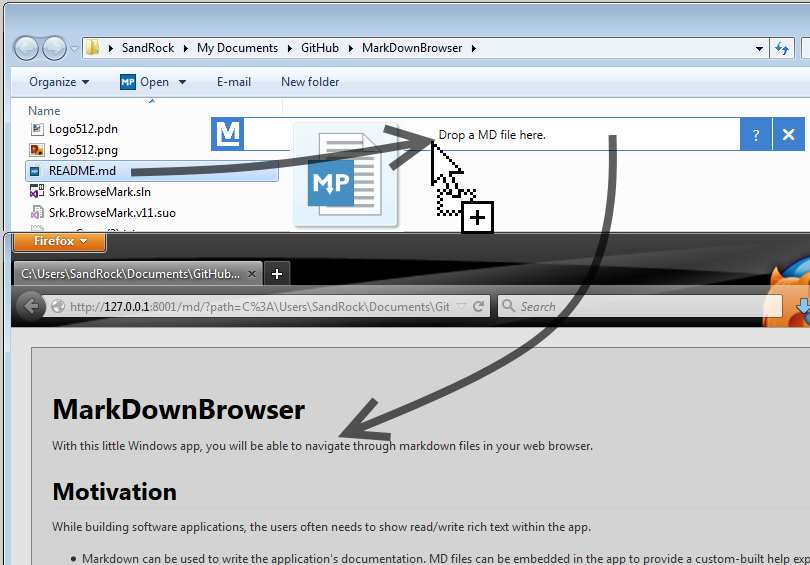

MarkDownBrowser
===============

With this little Windows app, you will be able to navigate through markdown files in your web browser.

Motivation
----------

While building software applications, the users often needs to show read/write rich text within the app.

* Markdown can be used to write the application's documentation. MD files can be embedded in the app to provide a custom-built help explorer.
 * Providing a good editing tool to non-developers is a start. Providing them a "viewer" is nice for them. 
* Markdown can be used by end-users to write a review or a description.  
 * Within a non-web application, a web-rendering of Markdown may be a good implementation.  

How it's built, some history
----------------------------

The app is a WPF app built on .NET 4.0. An internal web server is started to provide a web browsing experience.

At the beginning I was searching for a way to render md directly into XAML or WPF controls. As there is no "md reader" that would work like a `StreamReader` (I think of the `ReadLine` method that iterates over blocks), I searched for a library. I found [Markdown.XAML](https://github.com/theunrepentantgeek/Markdown.XAML). After some experimentations, I found it difficult to change the rendering mode and styles. So I abandoned it and searched somewhere else.

Then I though about a `WebBrowser` control, doing the render to HTML in-memory and injecting the page in the browser. Navigation would be difficult to implement, maybe by intercepting the navigation event, cancelling it, and rendering another page instead... The browser is not easy to manipulate.

So I started building the web-rendering and stumbled on [uhttpsharp](https://github.com/raistlinthewiz/uhttpsharp), a micro web server built with C#. Great, I could just start the server on localhost and let the `WebBrowser` control navigate through pages, skipping manual HTML page loading.

The HTTP thing was working. I had to [refactor uhttpsharp a bit](https://github.com/sandrock/uhttpsharp) BTW.   

Now there is a bug with the `WebBrowser`. "Navigation to the webpage was canceled" it says. However it works well with Firefox. Weird. "This page can’t be displayed" says IE 11. OK, it's a IE thing, let's do it lean: cancel IE. So I removed the integrated browser code. I replaced it with a open-in-default-browser action. The `WebBrowser` is not a drop zone for the MD file you want to open.

The links between md files are rewritten during md render using a custom delegate integrated into the rendering engine's code ([markdownshrp](http://code.google.com/p/markdownsharp/)).

Code status
-----------

The actual code is not clean. I will clean it up later.

Usage
-----

Feel free to use/change this app for your own needs. 

My main usage is providing a simple md browser to my non-dev users so they can write and see the documentation they write or review.

To do
-----

* Build script
* Document how to quick-start using the app
* Show navigation through pages using screenshots
* Add patch for markdownsharp
* Extract CSS from layout into a CSS file

Possible enhancements
---------------------

* The HTTP server is using TCP port 8001.
 * Finding a free port before using it might be helpful to some users.
* The call to `Dispose` on the HTTP server object is not safe.
* Add a button to open a file using a dialog.
* Listen to clipboard for a path to a md file.
* Providing the app as a setup or ClickOnce installer.
* Theme selector
* Browser selector
* Print CSS

Notes for external assemblies
-----------------------------

### uhttpsharp

I did a lot of refactor on [uhttpsharp](https://github.com/raistlinthewiz/uhttpsharp). My changes are on my [fork](https://github.com/sandrock/uhttpsharp).

uhttpsharp is licensed under GPLv2.

### markdownsharp

I had to add delegate to the `Markdown` class of [markdownsharp](http://code.google.com/p/markdownsharp/). Changes are not included here as code. There's only a recompiled assembly. I'll provide a patch later.

markdownsharp is licensed under the MIT license.
